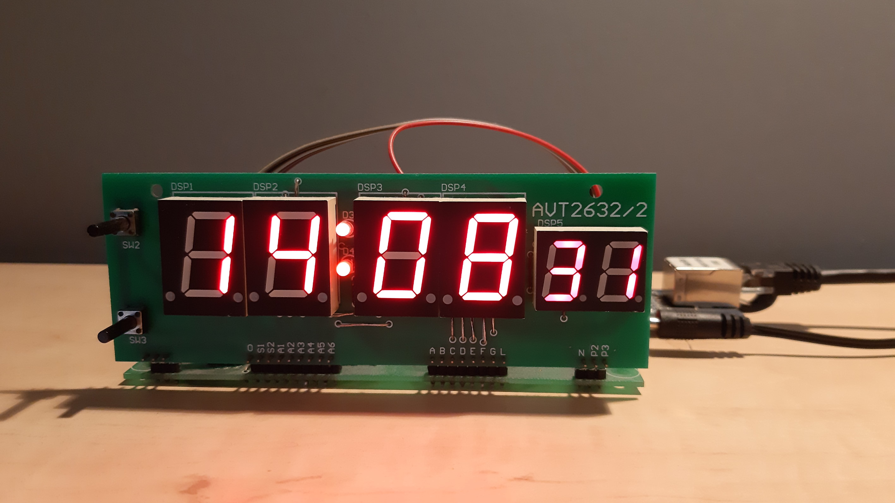

# AVR NTP Clock

A web-synchronized clock/calendar based on the AVT2632 kit, ATtiny4313, and ENC28J60.

## Description

This device is a typical clock based on 7-segment displays, with the following features:

- Time or date display
- Automatic synchronization with an NTP server
- Automatic network configuration using DHCP
- Configurable timezone and daylight saving time
- Rudimentary menu for adjusting settings

## Background

This project is an upgrade of the AVT2632 clock kit which adds time synchronization over Ethernet networks, while
minimizing the hardware changes to the kit. The largest AVR microcontroller pin-compatible with the kit is ATtiny4313
featuring 4KB of program memory and 256B of RAM. As such, the project became a challenge to fit a minimalistic network
stack and other functionality within this constrained environment.

**Warning:** due to the size constraints, code readability and maintainability was often sacrificed to save a few bytes.
Don't use it as reference for good coding practices.

## Hardware

The clock is based on the AVT2632 kit. As far as I know it's no longer available for sale, but it should be easy to
replicate based on the [schematic](https://serwis.avt.pl/manuals/AVT2632.pdf). Additionally, you'll need an ATtiny4313
and an ENC28J60 module (preferably with a built-in 3.3V regulator).

A few modifications to the schematic are required:

- Replace U2 with ATtiny4313
- Solder a jumper across SW1
- Cut trace between K and K1
- Connect K1 to K2 (GND)
- Connect ENC28J60 module as follows:
    - K - CS
    - H1 - SCK
    - H2 - SO
    - H3 - SI (may be labelled ST)
    - H4 (GND) - GND
    - VCC (output of U1, e.g. left-hand side of ZW1) - 5V

If your ENC28J60 module doesn't have a 3.3V regulator, you'll need an external one to convert the 5V supply to 3.3V.
Note that SPI lines don't need level shifters because ENC28J60 inputs are 5V tolerant.

The code also supports ATmega16 which I used for debugging, but I don't have a schematic for that.

## Compilation

Compiled binary is available on the [Releases](https://github.com/mwasacz/avr-ntp-clock/releases) page. The flash usage
is 4080 bytes (99.6%) when compiled with AVR-GCC version 5.4.0. If you want to compile it yourself, follow the
instructions:

- Windows: open [AvrNtpClock.atsln](AvrNtpClock.atsln) in Microchip Studio 7.0 (formerly Atmel Studio 7.0) and compile
the project. Make sure the Release configuration is selected.
- Linux: you can try [as2make](https://github.com/noctarius/as2make) to generate a makefile from
[AvrNtpClock.cproj](AvrNtpClock/AvrNtpClock.cproj), but I haven't tested it.

To flash the MCU you need to use a breadboard as AVT2632 doesn't have an ISP socket. Remember to program the Flash,
EEPROM, and Fuse Bits (see [main.c](AvrNtpClock/main.c) for Fuse Bit settings).

## Usage

After connecting the device to network, it obtains an IP automatically (provided that a DHCP server is available). Then,
date and time is obtained from an NTP server (configurable in the settings).

By default, time is shown in the `Hour-Minute-Second` format. Blinking dots between hours and minutes indicate that a
synchronization happened within the last hour. When SW2 is pressed, the current date is shown as `Day-Month-DayOfWeek`.
When SW3 is pressed, the current year is shown along with network synchronization status code:

| Code | Status                       |
|------|------------------------------|
| 0    | ENC28J60 not responding      |
| 1    | Network cable disconnected   |
| 2    | Waiting for DHCP offer       |
| 3    | Waiting for DHCP ack         |
| 4    | Waiting for DHCP ack (renew) |
| 5    | Waiting for ARP reply        |
| 6    | Waiting for NTP reply        |
| 7    | Synchronized                 |

Settings can be accessed by pressing SW2 and SW3 at the same time. The interface is rather rudimentary as there are only
two buttons available. There is a total of 50 configuration bytes. In the settings menu, the display shows `DVVVBB`.
`BB` indicates which configuration byte is being edited (00-49). `VVV` is the value of that byte (000-255). `D` shows
which digit of the current byte is being edited (1-3 or blank). Pressing SW3 cycles through `D`. If `D` is 1, 2, or 3,
pressing SW2 increments the hundreds, tens, or ones respectively. If `D` is blank, pressing SW2 moves to the next byte
(or exits the menu after the last byte). The configuration bytes are as follows:

| Byte index | Setting                       | Unit                         | Range | Default |
|------------|-------------------------------|------------------------------|-------|---------|
| 0          | Manually set current UTC time | Year (within century)        | 0-99  | 0       |
| 1          |                               | Month                        | 1-12  | 1       |
| 2          |                               | Day                          | 1-31  | 1       |
| 3          |                               | Hour                         | 0-23  | 0       |
| 4          |                               | Minute                       | 0-59  | 0       |
| 5          |                               | Second                       | 0-59  | 0       |
| 6          | Timezone 1 UTC offset         | 1 - plus, 0 - minus          | 0-1   | 1       |
| 7          |                               | Hours                        | 0-23  | 1       |
| 8          |                               | Minutes                      | 0-59  | 0       |
| 9          | Timezone 1 ends on            | Month                        | 1-12  | 3       |
| 10         |                               | Week within month (5 - last) | 1-5   | 5       |
| 11         |                               | Day of week                  | 1-7   | 7       |
| 12         |                               | Hour                         | 0-23  | 2       |
| 13         |                               | Minute                       | 0-59  | 0       |
| 14         | Timezone 2 UTC offset         | 1 - plus, 0 - minus          | 0-1   | 1       |
| 15         |                               | Hours                        | 0-23  | 2       |
| 16         |                               | Minutes                      | 0-59  | 0       |
| 17         | Timezone 2 ends on            | Month                        | 1-12  | 10      |
| 18         |                               | Week within month (5 - last) | 1-5   | 5       |
| 19         |                               | Day of week                  | 1-7   | 7       |
| 20         |                               | Hour                         | 0-23  | 3       |
| 21         |                               | Minute                       | 0-59  | 0       |
| 22         | Daytime ends on               | Hour                         | 0-23  | 22      |
| 23         |                               | Minute                       | 0-59  | 0       |
| 24         | Daytime brightness            | 0 - blank, 9 - full          | 0-9   | 9       |
| 25         | Nighttime ends on             | Hour                         | 0-23  | 7       |
| 26         |                               | Minute                       | 0-59  | 0       |
| 27         | Nighttime brightness          | 0 - blank, 9 - full          | 0-9   | 4       |
| 28         | NTP server IP                 | Most significant byte        | 0-255 | 134     |
| 29         |                               | ...                          | 0-255 | 130     |
| 30         |                               | ...                          | 0-255 | 4       |
| 31         |                               | Least significant byte       | 0-255 | 17      |
| 32         | Device IP (or 0 to use DHCP)  | Most significant byte        | 0-255 | 0       |
| 33         |                               | ...                          | 0-255 | 0       |
| 34         |                               | ...                          | 0-255 | 0       |
| 35         |                               | Least significant byte       | 0-255 | 0       |
| 36         | Gateway IP (or 0 to use DHCP) | Most significant byte        | 0-255 | 0       |
| 37         |                               | ...                          | 0-255 | 0       |
| 38         |                               | ...                          | 0-255 | 0       |
| 39         |                               | Least significant byte       | 0-255 | 0       |
| 40         | Netmask (or 0 to use DHCP)    | Most significant byte        | 0-255 | 0       |
| 41         |                               | ...                          | 0-255 | 0       |
| 42         |                               | ...                          | 0-255 | 0       |
| 43         |                               | Least significant byte       | 0-255 | 0       |
| 44         | Device MAC                    | Most significant byte        | 0-255 | 78      |
| 45         |                               | ...                          | 0-255 | 84      |
| 46         |                               | ...                          | 0-255 | 80      |
| 47         |                               | ...                          | 0-255 | 99      |
| 48         |                               | ...                          | 0-255 | 108     |
| 49         |                               | Least significant byte       | 0-255 | 107     |

## License

This project is released under the [GPLv2 license](LICENSE). Some parts of the code are based on
[Procyon AVRlib](http://www.procyonengineering.com/embedded/avr/avrlib/) by Pascal Stang and
[Tuxgraphics NTP clock](http://www.tuxgraphics.org/electronics/201302/avr-ntp-clock-2x.shtml) by Guido Socher, both
released under the [GPLv2 license](https://www.gnu.org/licenses/old-licenses/gpl-2.0.txt).
